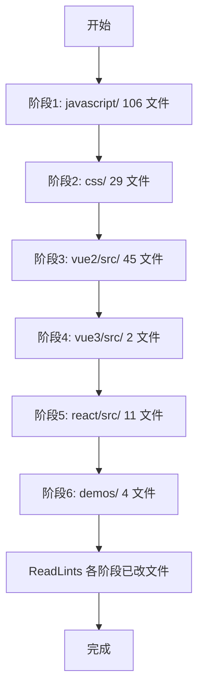

# 全量审查修复并补注释

**总览**：对仓库中 177 个学习 demo 源文件（跳过 `libs/`、`lib/` 与自动生成的 `index.html`）逐个审查，修复运行时 bug、过时 API、错误注释，并按统一规范补全教学注释；分阶段按 README 学习顺序推进（JS → CSS → Vue2 → Vue3 → React → demos）。

## 任务清单

- [ ] **阶段 1**：`javascript/` 6 个一级目录约 106 个文件，逐个修复 bug 与补注释
- [ ] **阶段 2**：`css/` 29 个文件，修复资源/注释不符问题、废弃写法标注
- [ ] **阶段 3**：`vue2/src/` 45 个文件，修复 VueX/router/响应式 bug，补充空壳 demo
- [ ] **阶段 4**：`vue3/src/` 2 个文件，修复 API 未导入与拼写错误
- [ ] **阶段 5**：`react/src/` 11 个文件，统一改 `createRoot`、修复 `ele1`/`this`/生命周期拼写
- [ ] **阶段 6**：`demos/` 4 个文件，修复拖放逻辑与补注释
- [ ] **收尾**：按阶段运行 ReadLints 补错，最后提供变更摘要表

## 范围与边界

- **审查范围**：`javascript/`、`css/`、`vue2/src/`、`vue3/src/`、`react/src/`、`demos/` 下所有 `.html` / `.js` / `.css`，共 177 个文件。
- **跳过**：`*/libs/*`、`*/lib/*`、根 `index.html`、`manifest.json`、`vue2/src/源码简读/vue.js`（第三方源码副本）以及 [`.gitignore`](.gitignore)、[`.editorconfig`](.editorconfig)。
- **不重命名文件**：仅在文件名与内容严重不符时，在头注释中标注实际内容（避免破坏外链/索引）。
- **反面教材代码**（例如 `react/src/02-JSX-条件渲染短路.html` 的 `arr.length && JSX` 渲染 `0`）：保留代码，但在注释中明确标注「反面教材 / 易错点」。
- **缺失外部资源**（rem 的 `./img/`、media-queries 的 `images/`）：保留代码，在头注释说明依赖；不重新下载图片。

## 每个文件的统一处理流程

1. **读取**当前文件。
2. **修复运行时 bug**（未定义变量、严格模式 `this`、错误的 API 名）。
3. **修正错误注释**（拼写、与代码不符、过时表述）。
4. **更新过时 API**（如 React 18 改用 `createRoot`），旧写法若作教学保留则加「⚠️ 过时」标注。
5. **按 `CONVENTIONS.md` §4 添加文件头注释**：分类、主题、要点 3 条。
6. **关键代码段补 1-3 行教学注释**（要点 / 易错点 / 对比）。

## 关键修复清单（高优先）

### JavaScript 运行时 bug

- [`javascript/01-基础/箭头函数.html`](javascript/01-基础/箭头函数.html)：`new ArrowFunc()` 抛错 → 注释化并标注「箭头函数不能 new」。
- [`javascript/01-基础/函数进阶.html`](javascript/01-基础/函数进阶.html)：严格模式下 `fun1()` 的 `this` 是 `undefined`；`devide` 实现写成乘法 → 修复函数体与变量名。
- [`javascript/01-基础/正则/01-正则-URL路径匹配.html`](javascript/01-基础/正则/01-正则-URL路径匹配.html)：`[course|unit]` 改为 `(?:course|unit)`。
- [`javascript/02-函数与作用域/闭包/02-闭包-内存泄漏与修复.html`](javascript/02-函数与作用域/闭包/02-闭包-内存泄漏与修复.html)：`const inner = ...; inner = null` 抛错 → 改为 `let`；补 `<button id="myBtn">` 元素。
- [`javascript/04-ES6+/class详解/class类声明.html`](javascript/04-ES6+/class详解/class类声明.html)：无 `extends` 不能 `super()`；`const` 类名不能重新赋值 → 去掉/改写。
- [`javascript/04-ES6+/class详解/extends.html`](javascript/04-ES6+/class详解/extends.html) & `类与原型.html`：`p1.#userAgeName` 改为 `this.#userAgeName`。
- [`javascript/04-ES6+/class详解/私有构造函数.html`](javascript/04-ES6+/class详解/私有构造函数.html)：注释化非法 `new`，加教学说明。
- [`javascript/04-ES6+/异步/Promise/01-Promise-all并发与then串行.html`](javascript/04-ES6+/异步/Promise/01-Promise-all并发与then串行.html)：`.then(p1).then(p2)` 改为 `.then(() => p1()).then(() => p2())`。
- [`javascript/04-ES6+/异步/generator与async/01-generator-基础yield与next.html`](javascript/04-ES6+/异步/generator与async/01-generator-基础yield与next.html)：`a.iterate` 未定义 → 修正为 `Symbol.iterator` 演示。
- [`javascript/04-ES6+/集合/WeakMap.html`](javascript/04-ES6+/集合/WeakMap.html)：补 `#myButton` DOM 节点。
- [`javascript/06-浏览器API/WebWorker/01-基础/worker.js`](javascript/06-浏览器API/WebWorker/01-基础/worker.js)：`100000000000` 改为 `1e7`；「群居对象」→「全局对象」。
- [`javascript/06-浏览器API/存储/03-获取剩余容量.html`](javascript/06-浏览器API/存储/03-获取剩余容量.html)：把 Promise 改为 `await`。
- [`javascript/07-进阶/手写Promise/promiseAll.html`](javascript/07-进阶/手写Promise/promiseAll.html)：用计数器代替 `length` 判断；title「fuck」改正。

### Vue 2 关键 bug

- [`vue2/src/基础语法/abbr.html`](vue2/src/基础语法/abbr.html)：`:bind:title` → `:title`。
- [`vue2/src/基础语法/device.html`](vue2/src/基础语法/device.html)：`window.clientWidth` → `window.innerWidth`。
- [`vue2/src/基础语法/bindClass.html`](vue2/src/基础语法/bindClass.html)：`data` 中补 `hasError: false`。
- [`vue2/src/响应式原理/defineProperty.html`](vue2/src/响应式原理/defineProperty.html)：栈溢出 → 引入闭包私有 `_name`。
- [`vue2/src/响应式原理/timeline.html`](vue2/src/响应式原理/timeline.html)：`onclick="handleClickFn"` → `@click="handleClickFn"`；`push()` 加参数。
- [`vue2/src/路由与状态/VueX.html`](vue2/src/路由与状态/VueX.html) & `VueX-action.html`：`state` 加 `count: 0`、`doneTodos` 取数组长度。
- [`vue2/src/路由与状态/Module.html`](vue2/src/路由与状态/Module.html)：重写为真正的 `modules` 演示，或在头注释标注「与文件名不符，实际是 actions 演示」。
- [`vue2/src/路由与状态/routerProtected.html`](vue2/src/路由与状态/routerProtected.html)：补 Login 路由 + `beforeRouteUpdate` 调用 `next()`。

### Vue 3 关键 bug

- [`vue3/src/响应式状态.html`](vue3/src/响应式状态.html)：从 `Vue` 解构 `reactive/ref/shallowRef`；注释 `.vue` → `.value`。
- [`vue3/src/生命周期钩子.html`](vue3/src/生命周期钩子.html)：解构所有 `onXxx` 钩子；`onUnMounted` → `onUnmounted`。

### React 关键 bug

- [`react/src/01-入门-元素与渲染.html`](react/src/01-入门-元素与渲染.html)：删除/定义未声明的 `ele1`。
- [`react/src/03-元素与函数组件.html`](react/src/03-元素与函数组件.html)：`{fun}` → `{fun()}`。
- [`react/src/07-class-state与props.html`](react/src/07-class-state与props.html)：`onClick={() => console.log(this)}`；移除多余 render 参数；标注 `this.state.id` 缺失。
- [`react/src/09-setState-函数式更新.html`](react/src/09-setState-函数式更新.html)：注释「展示 1」→「展示 10」。
- [`react/src/10-Clock-setState-批处理对比.html`](react/src/10-Clock-setState-批处理对比.html)：`componentWillUnMount` → `componentWillUnmount`。
- `react/src/02-09` 等使用 `ReactDOM.render` 的文件：统一改为 `ReactDOM.createRoot(...).render(...)`。
- [`react/src/11-class-完整生命周期与API.html`](react/src/11-class-完整生命周期与API.html)：废弃钩子前加 `UNSAFE_` 或标注 deprecated。

### CSS 关键问题

- [`css/04-响应式/vw-vh/index.html`](css/04-响应式/vw-vh/index.html)：头注释标注「实现实际是 rem，并非 vw/vh」。
- [`css/04-响应式/media-queries/media-queries.css`](css/04-响应式/media-queries/media-queries.css)：注释 `560` → `480`。
- [`css/03-视觉效果/按钮/button.html`](css/03-视觉效果/按钮/button.html)：`:active` 的 `box-shadow` 改成缩小或修正注释。
- [`css/01-布局/grid/index.html`](css/01-布局/grid/index.html)：让 grid3 / grid4 真正不同（如一个用 `grid-template-areas`）。
- [`css/02-动画/loading/load2.html`](css/02-动画/loading/load2.html)：补充标准 `@keyframes`；移除死代码 `loadAni`。
- [`css/02-动画/loading/load4.html`](css/02-动画/loading/load4.html)：文字最终颜色避免与背景同色。

## 共性补注释（注释偏少需补充）

为所有标为「注释偏少」的文件统一：

```html
<!--
  分类: <一级目录>
  主题: <根据文件名提炼>
  要点:
    - <要点 1>
    - <要点 2>
    - <要点 3>
-->
```

并在关键代码块前加 1-2 行说明（不复述代码，只解释意图 / 易错点）。

## 执行顺序（按 README 学习顺序）

1. `javascript/01-基础/` → `09-Canvas/`（~106 文件，量最大）
2. `css/`（~29 文件）
3. `vue2/src/`（~45 文件）
4. `vue3/src/`（2 文件）
5. `react/src/`（11 文件）
6. `demos/`（~4 文件）

每个阶段完成后，先做一遍内部连读校验（同目录内交叉引用、文件名/标题一致性），再进入下一阶段。

## 任务流图



## 注意事项 / 不做的事

- **不会**重新生成 `index.html`（按 [`CONVENTIONS.md`](CONVENTIONS.md) §6 由 `scripts/build-index.mjs` 生成，等所有改完后由你执行或我执行一次）。
- **不会**修改 `libs/`、`lib/` 内任何第三方库。
- **不会**重命名文件（避免破坏 `index.html` / `manifest.json` 中的链接，仅头注释说明）。
- **不会**对反面教材代码改成「正确」版（保留 + 加标注）。
- **不会**新增或删除依赖。

## 工作量说明

177 个文件每个都需要读 + 改，预计需要数百次工具调用。我会尽量在每次输出中批处理（多文件 `Read` 并发、同主题文件连续编辑），但仍然会消耗较多时间和上下文。如果中途上下文紧张，会先停下来提示你。

## 完成后

- 运行 `node scripts/build-index.mjs` 重新生成 `index.html` / `manifest.json`（如有新增文件或头注释影响展示）。
- 给出修复变更摘要表（哪些是 bug 修复 / 哪些只是补注释）。
