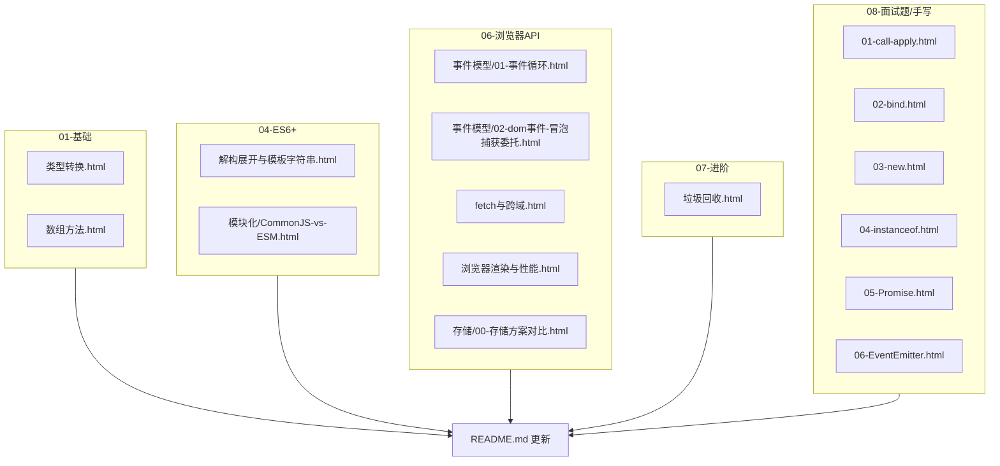

# JavaScript 面试知识点补齐计划

> 仓库当前 `apps/javascript/` 共 **120** 个 demo，完整清单见 [`apps/javascript/README.md`](../../apps/javascript/README.md)（由 `node scripts/sync-readmes.mjs` 根据头注释同步）。

## 目标

结合当前 `apps/javascript/` 目录，优先补齐 JS 基础面试中最常见、最容易被追问的空缺：类型转换、数组 API、DOM 事件、存储对比、ES6 语法糖、模块化对比、fetch/CORS、GC 原理、浏览器渲染，以及高频手写题。

本轮按“基础高频优先，其次浏览器与进阶，最后扩展专题”的顺序执行。

## 已补齐文件

## 完成清单

- [x] 新建 `apps/javascript/01-基础/类型转换.html`
- [x] 新建 `apps/javascript/01-基础/数组方法.html`
- [x] 新建 `apps/javascript/04-ES6+/解构展开与模板字符串.html`
- [x] 新建 `apps/javascript/04-ES6+/模块化/CommonJS-vs-ESM.html`
- [x] 重命名 `apps/javascript/06-浏览器API/事件模型/event.html` 为 `apps/javascript/06-浏览器API/事件模型/01-事件循环.html`
- [x] 新建 `apps/javascript/06-浏览器API/事件模型/02-dom事件-冒泡捕获委托.html`
- [x] 新建 `apps/javascript/06-浏览器API/存储/00-存储方案对比.html`
- [x] 新建 `apps/javascript/06-浏览器API/fetch与跨域.html`
- [x] 新建 `apps/javascript/06-浏览器API/浏览器渲染与性能.html`
- [x] 新建 `apps/javascript/07-进阶/垃圾回收.html`
- [x] 新建 `apps/javascript/08-面试题/手写/` 下 6 个手写 demo
- [x] 更新 `apps/javascript/README.md` 目录表与推荐顺序说明

---

## 一、高优先级：基础高频

### 1. `apps/javascript/01-基础/类型转换.html`

覆盖：

- `==` vs `===` 高频隐式转换题：`null == undefined`、`[] == false`、`'' == 0` 等
- `ToPrimitive` / `ToNumber` / `ToString` 的理解入口
- `Symbol.toPrimitive`、`valueOf`、`toString` 的调用顺序
- 浮点精度：`0.1 + 0.2 !== 0.3`、`Number.EPSILON`、`toFixed`
- `NaN` 判断：`Number.isNaN`、`isNaN`、`Object.is`
- 推荐实践：业务比较优先 `===`，默认值优先按场景选择 `??`

### 2. `apps/javascript/01-基础/数组方法.html`

覆盖：

- 迭代方法：`forEach` / `map` / `filter` / `reduce` / `some` / `every`
- 查找方法：`find` / `findIndex` / `includes` / `indexOf`
- 是否改变原数组：`sort` / `reverse` / `splice` 与 `slice` / `concat` 对比
- `sort` 默认字典序陷阱
- 面试常写：去重、扁平化、`reduce` 分组统计

### 3. `apps/javascript/08-面试题/手写/`

本轮从原计划 5 个扩展为 6 个，因为 `call/apply/bind` 通常是同组高频题。

| 文件 | 核心内容 |
|---|---|
| `01-call-apply.html` | 手写 `myCall` / `myApply`：临时属性调用、`thisArg` 兜底、参数处理 |
| `02-bind.html` | 手写 `myBind`：返回新函数、预置参数、普通调用与 `new` 调用、`Object.create(fn.prototype)` 维护原型链 |
| `03-new.html` | 手写 `myNew`：创建对象、链接原型、执行构造函数、处理构造函数返回对象 |
| `04-instanceof.html` | 手写 `myInstanceof`：用 `Object.getPrototypeOf` 沿原型链查找，处理原始值与 `null` |
| `05-Promise.html` | 面试简化版 Promise：状态机、异步 then、链式调用、`catch`、`finally` |
| `06-EventEmitter.html` | `on` / `off` / `once` / `emit`，并处理派发过程中监听器数组变化 |

注意：`05-Promise.html` 没有标成“完整 Promise/A+ 实现”。它定位为面试简化版，避免把 thenable 解析、循环引用检测等规范细节过早压进基础复习。

---

## 二、中优先级：浏览器与 ES6 高频

### 4. DOM 事件模型

- `apps/javascript/06-浏览器API/事件模型/01-事件循环.html`
  - 原 `event.html` 改名，避免和 DOM 事件流混淆
  - 内容仍聚焦同步任务、微任务、宏任务、Promise、async/await、setTimeout
- `apps/javascript/06-浏览器API/事件模型/02-dom事件-冒泡捕获委托.html`
  - 三层嵌套元素演示 capture / bubble 顺序
  - 对比 `stopPropagation` 与 `stopImmediatePropagation`
  - 用 `ul > li` 演示事件委托

### 5. `apps/javascript/06-浏览器API/存储/00-存储方案对比.html`

覆盖：

- Cookie / sessionStorage / localStorage / IndexedDB 对比
- 容量、生命周期、是否随请求发送、API 同步性
- Cookie 属性：`Expires` / `Max-Age` / `Domain` / `Path` / `SameSite` / `Secure` / `HttpOnly`
- `localStorage`、`sessionStorage`、`document.cookie` 可运行读写 demo
- IndexedDB 指向现有 localforage 系列，不重复大段封装

### 6. `apps/javascript/04-ES6+/解构展开与模板字符串.html`

覆盖：

- 数组/对象解构、默认值、重命名、嵌套解构
- rest 收集剩余项
- spread 展开数组、对象与函数参数
- spread 浅拷贝陷阱
- 模板字符串、标签模板
- 可选链 `?.` 与空值合并 `??`

### 7. `apps/javascript/04-ES6+/模块化/CommonJS-vs-ESM.html`

覆盖：

- CommonJS 与 ES Module 语法差异
- 运行时加载 vs 静态解析
- 同步加载 vs 浏览器异步模块加载
- 导出值与实时绑定差异
- tree-shaking 与现代前端默认选择

### 8. `apps/javascript/06-浏览器API/fetch与跨域.html`

覆盖：

- `fetch` 基础请求与 JSON 解析
- `response.ok` 与 `try/catch` 错误处理
- 同源策略、简单请求、预检请求
- `Access-Control-Allow-Origin` 等 CORS 响应头
- `mode: 'no-cors'` 的限制
- public API 请求可选，页面内提供本地 fallback，避免网络不可用时无法学习

---

## 三、中低优先级：进阶原理

### 9. `apps/javascript/07-进阶/垃圾回收.html`

覆盖：

- 可达性与根对象
- 标记清除为什么能处理循环引用
- 闭包引用导致对象保活
- WeakMap / WeakSet 不阻止对象回收
- 开发实践：解除事件、定时器、大对象引用

### 10. `apps/javascript/06-浏览器API/浏览器渲染与性能.html`

覆盖：

- 关键渲染路径：HTML -> DOM -> CSSOM -> Render Tree -> Layout -> Paint -> Composite
- 重排、重绘、合成的区别
- 读写布局属性混用导致性能问题
- `DocumentFragment` 批量插入
- `transform` / `opacity` 动画与 `requestAnimationFrame` 的衔接

---

## 推荐学习顺序

建议顺序：

`01-基础 → 02-函数与作用域 → 03-对象与原型 → 04-ES6+ → 05-元编程 → 06-浏览器API → 07-进阶 → 08-面试题 → 09-Canvas`

刷手写题建议放在这些知识之后：

- `call/apply/bind`：学完 `this指向`
- `new/instanceof`：学完 `对象与原型`
- `Promise`：学完 `04-ES6+/异步/Promise`
- `EventEmitter`：学完 DOM 事件和基础发布订阅概念

## 后续可选补齐

以下内容本轮没有展开，适合后续单独补：

- HTTP 缓存
- XSS / CSRF 安全专题
- LRU / compose / 更多算法题
- 事件循环在 Node.js 与浏览器中的差异

## 验证方式

- 检查所有新增 HTML 文件存在
- 抽取每个 HTML 中的普通 `<script>` 内容，用 `node --check` 做基础语法检查
- 检查 README 中已纳入新增目录说明
- 交互 demo 可在浏览器直接打开后手动点击验证
